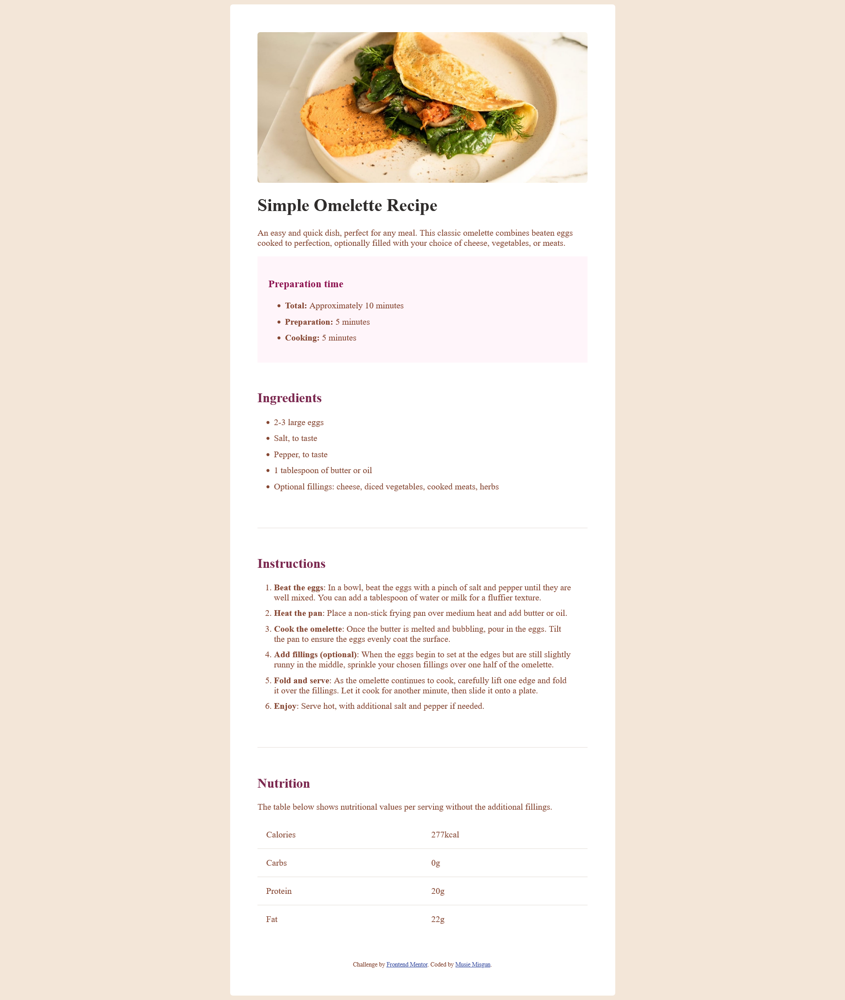

# Frontend Mentor - Recipe page solution

This is a solution to the [Recipe page challenge on Frontend Mentor](https://www.frontendmentor.io/challenges/recipe-page-KiTsR8QQKm). Frontend Mentor challenges help you improve your coding skills by building realistic projects.

## Table of contents

- [Overview](#overview)
  - [The challenge](#the-challenge)
  - [Screenshot](#screenshot)
  - [Links](#links)
- [My process](#my-process)
  - [Built with](#built-with)
  - [What I learned](#what-i-learned)
  - [Continued development](#continued-development)
  - [Useful resources](#useful-resources)
- [Author](#author)
- [Acknowledgments](#acknowledgments)

**Note: Delete this note and update the table of contents based on what sections you keep.**

## Overview

### Screenshot



### Links

- Solution URL: [Solution URL here](https://www.frontendmentor.io/profile/Natty-tech/solutions)

## My process

### Built with

- Semantic HTML5 markup
- CSS custom properties
- Flexbox
- CSS Grid

### What I learned

```html
<div class="gridbox">
  <p class="bordereddiv">Calories</p>
  <p class="bordereddiv">277kcal</p>
  <p class="bordereddiv">Carbs</p>
  <p class="bordereddiv">0g</p>
  <p class="bordereddiv">Protein</p>
  <p class="bordereddiv">20g</p>
  <p>Fat</p>
  <p>22g</p>
</div>
```

```css
.bordereddiv {
  border-bottom: 1px solid hsl(30, 18%, 87%);
}
```

### Continued development

Use this section to outline areas that you want to continue focusing on in future projects. These could be concepts you're still not completely comfortable with or techniques you found useful that you want to refine and perfect.

**Note: Delete this note and the content within this section and replace with your own plans for continued development.**

## Author

- Website - [Musie Misgun](https://sparkling-taffy-9985b2.netlify.app/)
- Frontend Mentor - [@Natty-tech](https://www.frontendmentor.io/profile/Natty-tech)

## Acknowledgments

Jake Godsall helped me with making my websites more responsive than ever using (max-width and width) instead of writing media queries and it helped a lot.
Here is he's Frontend Mentor link (https://www.frontendmentor.io/profile/jakegodsall)
